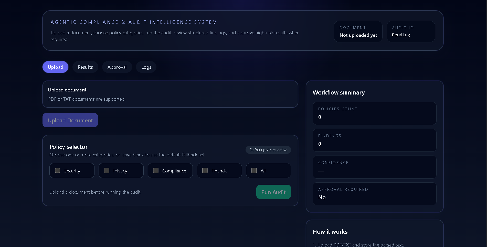

# Agentic Compliance & Audit Intelligence System

## 🚀 Live Preview

[](https://agentic-compliance-audit-system.vercel.app)

A full-stack compliance auditing platform with:

- **Backend:** FastAPI + LangGraph
- **Frontend:** React + TypeScript + Tailwind + Vite
- **LLM Layer:** Deterministic local adapter (default) or Groq-backed adapter (optional)

The system ingests documents, retrieves relevant policies, generates findings, adds reflection notes, computes risk/confidence, and routes high-risk outcomes to human approval.

---

## Table of contents

1. [Key features](#key-features)
2. [How the workflow works](#how-the-workflow-works)
3. [Tech stack](#tech-stack)
4. [Project structure](#project-structure)
5. [Local setup (Windows-first)](#local-setup-windows-first)
6. [Environment variables](#environment-variables)
7. [Run with Docker](#run-with-docker)
8. [API reference](#api-reference)
9. [Data persistence model](#data-persistence-model)
10. [Customization guide](#customization-guide)
11. [Troubleshooting](#troubleshooting)

---

## Key features

- Upload and parse **PDF** or **text-like files** (`.txt`, `.md`, `.csv`, `.log`)
- Policy retrieval by category (`security`, `privacy`, `compliance`, `financial`, `all`) or default mix
- Structured compliance findings per policy with:
	- severity
	- evidence
	- matched/missing requirements
	- recommendation
	- confidence
- Reflection pass loop for improved audit rationale
- Risk classification and confidence scoring
- Human-in-the-loop (HITL) approval for high-risk outcomes
- Audit logs viewable via API and frontend UI

---

## How the workflow works

LangGraph pipeline stages:

1. **`ingest_data`**
	 - Loads uploaded document text from in-memory repository.
2. **`policy_retrieval`**
	 - Selects and ranks relevant policies.
3. **`compliance_audit`**
	 - Evaluates document vs policy requirements and creates findings.
4. **`decision_router` + `reflection_loop`**
	 - Runs up to 2 reflection passes when needed.
5. **`action_trigger`**
	 - Assigns final `risk_level`, `confidence_score`, `status`, `needs_approval`.

Risk outcome behavior:

- **HIGH risk** → `WAITING_FOR_APPROVAL`
- **MEDIUM/LOW risk** → `COMPLETE`

Approval endpoint updates state to:

- `APPROVED` (if approved)
- `REJECTED` (if rejected)

---

## Tech stack

### Backend

- FastAPI
- Pydantic v2
- LangGraph
- PyPDF2
- Optional Groq API (`groq` package)

### Frontend

- React 18
- TypeScript
- Tailwind CSS
- Vite

### Deployment

- Docker + Docker Compose
- Nginx (frontend container)

---

## Project structure

```text
.
├── app/
│   ├── main.py                    # FastAPI app and routes
│   ├── graph.py                   # LangGraph workflow definition
│   ├── agents/
│   │   ├── llm_provider.py        # Deterministic/Groq adapter logic
│   │   ├── policy_store.py        # Policy definitions
│   │   ├── policy_agent.py        # Policy retrieval + ranking
│   │   ├── auditor.py             # Policy evaluation orchestration
│   │   └── reflector.py           # Reflection note generation
│   ├── ingestion/
│   │   └── pdf_parser.py          # Document parser
│   ├── models/
│   │   └── schemas.py             # Request/response/state models
│   └── utils/
│       ├── audit_logger.py        # Per-audit step logs
│       └── repositories.py        # In-memory repositories
├── frontend/
│   ├── src/components/            # UI components
│   ├── src/services/api.ts        # API client
│   └── src/types/api.ts           # Shared frontend interfaces
├── deployment/
│   ├── docker-compose.yml
│   ├── Dockerfile.backend
│   └── Dockerfile.frontend
├── scripts/
│   ├── start_backend.ps1
│   ├── start_frontend.ps1
│   └── start_system.ps1
├── requirements.txt
└── README.md
```

---

## Local setup (Windows-first)

### 1) Prerequisites

- Python 3.11+ (3.12 recommended)
- Node.js 20+
- npm

### 2) Backend setup

From repository root:

```powershell
python -m venv .venv
.\.venv\Scripts\Activate.ps1
pip install -r requirements.txt
uvicorn app.main:app --host 0.0.0.0 --port 8000 --reload
```

### 3) Frontend setup

In a new terminal:

```powershell
cd frontend
npm install
npm run dev -- --host 0.0.0.0 --port 5173
```

### 4) Access

- Frontend: http://127.0.0.1:5173
- Backend: http://127.0.0.1:8000
- OpenAPI docs: http://127.0.0.1:8000/docs

### 5) Optional helper scripts

From repository root:

```powershell
.\scripts\start_system.ps1
```

Or separately:

```powershell
.\scripts\start_backend.ps1
.\scripts\start_frontend.ps1
```

---

## Environment variables

The app runs without external LLM credentials using deterministic fallback logic.

Set these only if you want Groq-backed inference:

```powershell
$env:GROQ_API_KEY = "your_groq_api_key"
$env:GROQ_MODEL = "llama-3.1-70b-versatile"
$env:AUDIT_MODEL_NAME = "llama-3.1-70b-versatile"
$env:GROQ_BASE_URL = "https://api.groq.com"
```

Frontend API base URL (optional):

```powershell
$env:VITE_API_BASE_URL = "http://localhost:8000"
```

---

## Run with Docker

From the `deployment` folder:

```bash
docker compose up --build
```

Services:

- Backend: http://localhost:8000
- Frontend: http://localhost:3000

Notes:

- Frontend container serves static build via Nginx on port `3000`.
- Backend container reads optional Groq env vars from Compose.

---

## API reference

### `GET /health`

Returns service status, counts, and active LLM provider/model info.

### `POST /upload`

Multipart form upload.

- Field: `file`

Response:

```json
{
	"document_id": "<id>",
	"filename": "policy_doc.pdf",
	"text_length": 1234
}
```

### `POST /run_audit`

Request:

```json
{
	"document_id": "<document_id>",
	"selected_policies": ["security", "privacy"]
}
```

Returns full `AuditState` with findings, notes, risk, and status.

### `POST /approve`

Request:

```json
{
	"audit_id": "<audit_id>",
	"approved": true
}
```

Sets status to `APPROVED` or `REJECTED`.

### `GET /audit/{audit_id}`

Returns latest `AuditState`.

### `GET /audit_log/{audit_id}`

Returns step-by-step audit log entries.

---

## Data persistence model

Current storage is **in-memory only**:

- Documents stored in `DocumentRepository`
- Audits stored in `AuditRepository`
- Logs stored in `AuditLogger`

This means all runtime data is reset when the backend process/container restarts.

---

## Customization guide

### Add or modify policies

Edit `app/agents/policy_store.py`:

- Add policy objects under existing categories
- Add new categories and include them in retrieval inputs

### Swap LLM providers

Implement or extend adapter logic in `app/agents/llm_provider.py` while preserving adapter methods:

- `evaluate_policy(document_text, policy)`
- `reflect_on_findings(findings)`

### Change risk routing behavior

Update `action_trigger` in `app/graph.py` for custom risk-to-status mapping.

### Add persistent storage

Replace in-memory repositories in `app/utils/repositories.py` with DB-backed implementations (PostgreSQL, Redis, etc.) while keeping the same method contracts.

---

## Troubleshooting

- **Frontend cannot reach backend**
	- Confirm backend is running on port `8000`.
	- Check `VITE_API_BASE_URL`.

- **PowerShell script execution blocked**
	- Run PowerShell as user and allow script execution for current session:
		- `Set-ExecutionPolicy -Scope Process Bypass`

- **No Groq key available**
	- System will continue using deterministic fallback adapter.

- **Uploaded unsupported file type**
	- Supported: `.pdf`, `.txt`, `.md`, `.csv`, `.log` (and empty extension).

---

## License

No license file is currently included in this repository. Add a `LICENSE` file if distribution terms are required.
